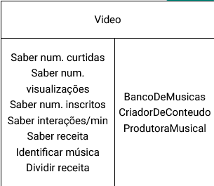
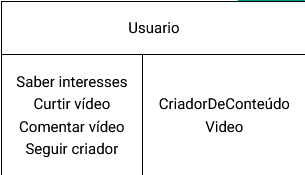
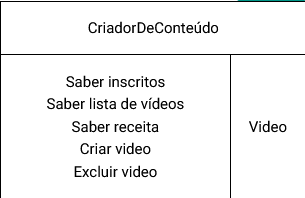

# Histórias de Usuário e Cartões CRC

Dante Junqueira Pedrosa - TM2

## 1. Histórias de Usuários

Para criar o software Youtube, foram captadas 3 (três) histórias de usuários visando estabelecer as principais funcionalidades do sistema. Foram entrevistados interessados de diferentes bases com diferentes usos:

### Marcos Vinícius - Estudante de Engenharia na UFMG

> Eu, como usuário comum, quero assistir vídeos, poder comentar e curtir os que eu achar mais interessante, para que sejam sugeridos opções semelhantes que achar interessante.

**Critérios de aceitação:**

1. Curtir vídeos
2. Comentar vídeos
3. Sugerir vídeos baseado em interesse

### José Faria - Criador de conteúdo em plataformas

> Eu, como criador de conteúdo, quero poder acompanhar em quais momentos meu vídeo teve mais visualizações, quantas pessoas se inscreveram ao assistir o vídeo e em quais momentos reagiram com o vídeo, para poder criar vídeos melhores.

**Critérios de aceitação:**

1. Saber momentos de vizualização no vídeo
2. Saber inscritos no vídeo
3. Saber momentos de curtida/descurtida

### Carla Mendes - Produtora musical

> Eu, como produtora musical, quero poder fazer parcerias com criadores de conteúdo, compor musicas para vídeos e ter meus direitos autorais protegidos, para impedir de ser tocado em vídeos sem que haja divisão da receita dos vídeos.

**Critérios de Aceitação**

1. Dividir receita entre múltiplos criadores
2. Identificar músicas tocadas no vídeo
3. Acessar banco de arquivos protegidos por direitos autorais.

## Modelagem - Cartões CRC

