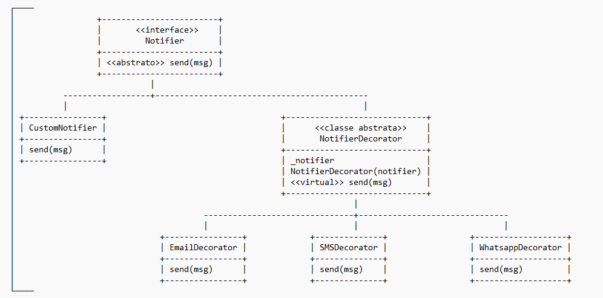

# VPL 09 - O Padrão de Projeto Decorator

## Descrição

Neste exercício você irá aprender sobre um padrão de projetos chamado [Decorator](https://en.wikipedia.org/wiki/Decorator_pattern). Trata-se de um dos 23 padrões de projetos do famoso livro conhecido como [GoF](https://en.wikipedia.org/wiki/Design_Patterns) (Gang of Four). Esse padrão de projetos permite alterar o comportamento de um objeto, de forma composicional. Em outras palavras, diferentes decoradores podem ser aplicados sobre o mesmo objeto. Por exemplo, se o objeto alvo é uma janela, você pode criar um decorador para adicionar-lhe uma borda, e outro para lhe adicionar uma cor de fundo. E outros decoradores podem ser criados, mesmo depois que o programa já esteja em uso. Decorator é um padrão muito útil, e muito poderoso. Ele é um pouco difícil de compreender logo de início. Mas persevere: vale a pena entender como funcionam decoradores!

Antes de implementar as classes faltantes, dê uma lida nesse [link](https://refactoring.guru/pt-br/design-patterns/decorator) para entender melhor o que esse padrão é capaz de fazer. Você vai notar que o padrão de projeto Decorator envolve diversos conceitos que vimos nas últimas aulas: Herança, Composição e Polimorfismo!

Você vai notar que este padrão de projeto se relaciona bastante com dois dos princípios SOLID que vimos: SRP e Open/Closed!

Neste exercício, você irá implementar uma biblioteca de notificação de mensagens, bem semelhante ao primeiro exemplo do link. Teremos dois canais de notificação: Email e SMS. A principal diferença é que gostaríamos de permitir que usuários da biblioteca possam enviar notificação apenas por Email ou apenas por SMS, ao invés de ter um comportamento padrão de envio por Email.

Você deverá implementar as seguintes classes:

1. Notifier: está será a interface da biblioteca de notificação (**já declarada**). Observe que o método `send` a ser implementado pelas subclasses recebe como parâmetro uma referência para um objeto do tipo `ostream`. Este argumento possui como valor padrão o stream de saída cout que estamos acostumados (definir um valor padrão para um argumento nos permite chamar a função passando apenas o primeiro parâmetro, i.e. `send(mensagem)`; neste caso, o valor do segundo parâmetro será `cout`). Porém, não conseguiríamos testar (facilmente) uma função que apenas escreve na tela uma mensagem. Nos testes, você deverá passar como segundo parâmetro de send um `ostringstream`; assim, você conseguirá recuperar a mensagem "enviada" (ela não será impressa na tela).

2. CustomNotifier: este será o componente concreto, o "placeholder" a ser customizado. A princípio, ele não faz nada. Iremos customizar seu comportamento decorando com um ou mais canais de notificação.

3. NotifierDecorator: este é o decorador base, que deve herdar de notifier. Deve utilizar de composição, possuindo um campo que é um ponteiro para um Notifier. O notifier será passado pelo construtor. O método send, herdado da interface Notifier, deve delegar a chamada ao Notifier informado no construtor da classe. Conceitualmente, esta classe é uma classe abstrata, no sentido de que não deveria ser instanciada; apenas os decoradores concretos devem ser instanciados. Para forçar a classe a ser abstrata, basta declarar o método `send` como puro (= **0**) na classe NotifierDecorator também (ainda que ele tenha uma implementação).

4. EmailDecorator e SMSDecorator: os decoradores de fato,  subclasses da classe NotifierDecorator. Devem implementar as versões específicas do método send (lembre-se de utilizar a implementação da superclasse NotifierDecorator, NotifierDecorator::send(...)).

Visualmente, você terá algo do tipo:



Por ser apenas um exemplo ilustrativo, os decorators devem enviar a mensagem recebida por parâmetro da seguinte forma:

- Email: "Enviando notificação por email: <mensagem>", onde mensagem é a string recebida por parâmetro
- SMS: "Enviando notificação por sms: <mensagem>", onde mensagem é a string recebida por parâmetro

Um exemplo de uso para notificação por email e sms:

```cpp
notify::Notifier *notifier = new notify::CustomNotifier();
notifier = new notify::EmailDecorator(notifier);
notifier = new notify::SMSDecorator(notifier);
notifier->send("mensagem de teste");
```

E o resultado:

```
Enviando notificação por email: mensagem de teste
Enviando notificação por sms: mensagem de teste
```

Confira o arquivo de testes para um exemplo de como implementar um teste passando um ostringstream.

## Instruções para Submissão

1. Todas as classes devem fazer parte do módulo "notify"
2. As classes Notifier, CustomNotifier e NotifierDecorator devem estar nos arquivos `notifier.hpp` e `notifier.cpp`
3. As classes EmailDecorator e SMSDecorator devem estar, respectivamente, nos arquivos `email.hpp`/`email.cpp` e `sms.hpp`/`sms.hpp`
4. Como sempre, implemente seus testes no arquivo `test.cpp` para validar sua implementação